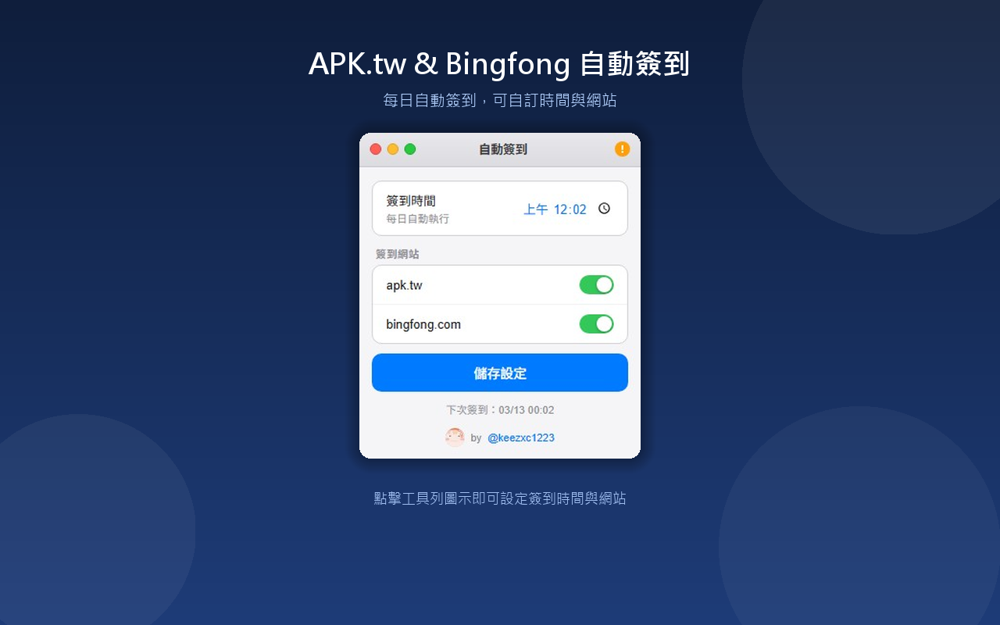

# APK.tw & Bingfong Auto Check-in

<p align="center">
  
</p>

<p align="center">
  輕量化 Chrome 擴充功能 — 每日自動簽到 <a href="https://apk.tw">APK.tw</a> 與 <a href="https://bingfong.com">Bingfong.com</a>
</p>

<p align="center">
  
  
  
  
</p>

## Screenshot

<p align="center">
  
</p>

## Features

- 每日自動在指定時間簽到 [APK.tw](https://apk.tw) 與 [Bingfong.com](https://bingfong.com)
- 自訂簽到時間（預設 00:01）
- 可分別開啟 / 關閉各網站的簽到功能
- 支援瀏覽器背景執行，關閉視窗後仍可自動簽到
- 簽到成功後自動重新整理頁面
- 每日重複檢查機制，避免重複簽到

## Tech Stack

| 項目 | 技術 |
|------|------|
| 平台 | Chrome Extension (Manifest V3) |
| 排程 | Chrome Alarms API |
| 儲存 | Chrome Storage Sync API |
| 內容注入 | Content Scripts (MAIN world) |
| 簽到偵測 | DOM 元素點擊 + localStorage 防重複 |

## Architecture

```
checkin-extension/
├── manifest.json       # 擴充功能設定（Manifest V3）
├── background.js       # Service Worker — 排程管理（Chrome Alarms）
├── content.js          # Content Script — 頁面簽到邏輯
├── popup.html          # 設定介面 UI
├── popup.js            # 設定介面邏輯
├── icons/              # 擴充功能圖示 (16/48/128px)
└── screenshots/        # Chrome Web Store 截圖
```

### 運作流程

```
┌─────────────┐    時間到     ┌───────────────┐    開啟分頁    ┌──────────────┐
│  background │ ───────────→ │  建立新分頁    │ ───────────→ │  content.js  │
│  (Alarms)   │              │  apk.tw        │              │  自動點擊簽到 │
│             │              │  bingfong.com  │              │  按鈕         │
└─────────────┘              └───────────────┘              └──────────────┘
       ↑                                                           │
       │              ┌───────────────┐                           │
       └───────────── │  popup.js     │      簽到成功 → 5秒後重新整理
         儲存設定      │  使用者設定    │      localStorage 記錄防重複
                      └───────────────┘
```

## Installation

### 方法一：開發者模式安裝

1. 下載或 Clone 此專案
   ```bash
   git clone https://github.com/keezxc1223/APK.tw-Bingfong-Auto-check-in.git
   ```
2. 開啟 Chrome，前往 `chrome://extensions/`
3. 右上角開啟 **開發人員模式**
4. 點擊 **載入未封裝項目**，選擇 `checkin-extension` 資料夾

### 方法二：Chrome Web Store

> 若已上架，可直接從 Chrome 線上應用程式商店安裝。

## Usage

1. 點擊工具列的擴充功能圖示
2. 設定每日簽到時間
3. 勾選想要自動簽到的網站（APK.tw / Bingfong）
4. 按下 **儲存設定** 即完成

## Configuration

| 設定項目 | 預設值 | 說明 |
|----------|--------|------|
| 簽到時間 | `00:01` | 每日自動簽到的時間（24 小時制） |
| APK.tw | 開啟 | 是否自動簽到 APK.tw |
| Bingfong | 開啟 | 是否自動簽到 Bingfong.com |

## Permissions

| 權限 | 用途 |
|------|------|
| `alarms` | 排程每日簽到任務 |
| `storage` | 儲存使用者設定（簽到時間、開關） |
| `host_permissions` | 存取 apk.tw / bingfong.com 進行簽到操作 |

## Notes

- 需先在瀏覽器中登入 [APK.tw](https://apk.tw) / [Bingfong.com](https://bingfong.com) 帳號，擴充功能才能正常簽到
- 若希望瀏覽器關閉後仍可簽到，請至 Chrome 設定 → 進階 → 系統，開啟「**Google Chrome 關閉時繼續執行背景應用程式**」
- 簽到成功後會自動在 5 秒後重新整理頁面

## License

MIT License
